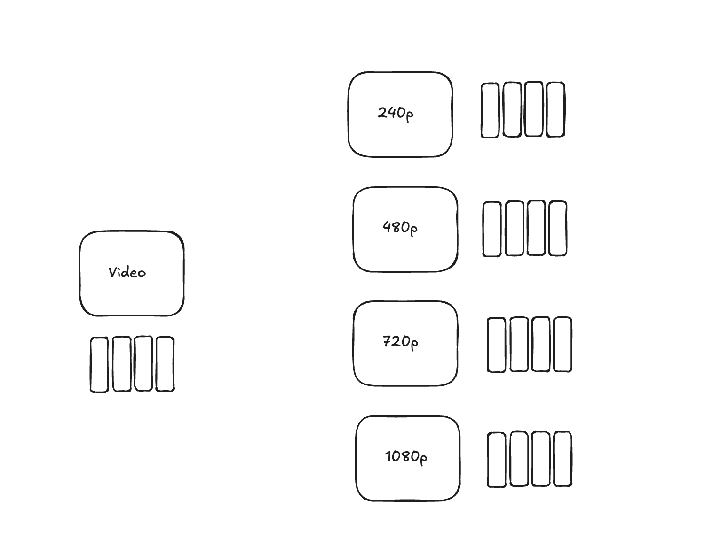

# Video-Streaming-App

Creating a video streaming platform, seems pretty simple but isn’t.

It looks as easy as uploading a file and storing it into a S3 bucket while creating a index in a db to fetch the file on the user’s click. Here’s the truth, you can not put the raw video into the DB and always parse it into the UI at the clients’ side. This is where a library FFMPEG comes into play. This repo is focussed on building a POC for a video streaming application which may not be production grade but is good enough to be converted to one. We explore the system design of how video streaming applications like youtube built their platforms.

When you hit a browser or click an image, the content gets downloaded at the client’s side and then is viewed to you. Suppose a user clicks on 480p, the video gets downloaded… Now they decide to shift to 1080p, the video again with a higher resolution gets downloaded. The person again decides to shift back to 720p, the 1080p and 720p again ends up on the client machine. 

To solve this we use a concept called **adaptive streaming** where the video is segmented into chunks. ~FFMPEG

[https://www.cloudflare.com/en-gb/learning/video/what-is-http-live-streaming/](https://www.cloudflare.com/en-gb/learning/video/what-is-http-live-streaming/)

In this repo, you will find the video being converted from mp4 to hls within your own machine. In a real time application the video is uploaded onto a storage system like S3 where it pushes each video to queue, this gets into a machine which runs the ffmpeg command to convert mp4 to hls and stores it back into a queue and updates the indices saved into a db.