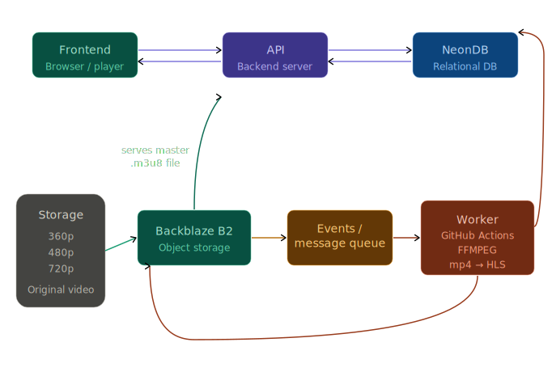

# Video-Streaming-App

> A proof-of-concept video streaming platform exploring adaptive streaming with FFMPEG and HLS.

---

## Navigation

[Overview](#overview) · [Architecture](#architecture) · [Running the App](#running-the-app)

---

## Overview

Creating a video streaming platform seems simple but isn't.

It looks as easy as uploading a file, storing it in an S3 bucket, and creating a DB index to fetch the file on the user's click. Here's the truth — you cannot put the raw video into the DB and always parse it at the client's side. This is where **FFMPEG** comes into play.

This repo is focused on building a POC for a video streaming application that may not be production-grade, but is good enough to be converted into one. We explore the system design of how video streaming applications like YouTube built their platforms.

### The Problem with Naive Video Delivery

When you click a video, the content is downloaded to the client's machine and then rendered. Suppose a user clicks 480p — the video gets downloaded. They switch to 1080p — the higher-resolution video gets downloaded again. They switch back to 720p — now both the 1080p and 720p copies end up on the client machine. We need to find a way to prevent downloading chunks that we don't need.

### The Solution: Adaptive Streaming


To solve this, we use a concept called **adaptive bitrate streaming**, where the video is segmented into small chunks. The player fetches only the chunks it needs, at the quality level the current bandwidth supports — no full re-downloads on quality switches.

This repo uses **FFMPEG** to convert `.mp4` files to **HLS (HTTP Live Streaming)** format locally. In a real-world application:

1. Video is uploaded to a storage system (e.g. S3)
2. The upload triggers a message onto a queue
3. A worker machine pulls from the queue and runs the FFMPEG conversion (`.mp4` → `.m3u8` + `.ts` chunks)
4. The processed segments are pushed back to storage
5. The DB index is updated with the new HLS manifest URL

> Further reading: [What is HTTP Live Streaming? — Cloudflare](https://www.cloudflare.com/en-gb/learning/video/what-is-http-live-streaming/)

---

## Architecture

### High-Level System Design


### HLS Segment Flow

```
Raw Video (mp4)
      │
      │  FFMPEG
      ▼
 master.m3u8  ──► 360p/index.m3u8  ──► seg001.ts, seg002.ts, ...
              ──► 720p/index.m3u8  ──► seg001.ts, seg002.ts, ...
              ──► 1080p/index.m3u8 ──► seg001.ts, seg002.ts, ...
```

The client's HLS player reads `master.m3u8`, selects a quality stream based on available bandwidth, and fetches only the required `.ts` chunks — switching quality between segments seamlessly.

### Component Breakdown

| Component | Responsibility |
|-----------|---------------|
| **Client (Browser)** | Plays HLS stream via a video player (e.g. `hls.js`, Video.js) |
| **BackBlaze B2 / Storage** | Stores both raw uploads and processed HLS segments, deletes the raw upload after conversion |
| **Message Queue(BullMQ)** | Decouples upload events from video processing |
| **FFMPEG Worker(Github Action)** | Transcodes `.mp4` into multi-bitrate HLS segments |
| **Database(NeonDB)** | Stores video metadata and `m3u8` manifest URLs |

---

## Running the App

### Prerequisites

- [Node.js](https://nodejs.org/) (v18+)
- [FFMPEG](https://ffmpeg.org/download.html) installed and available on your `PATH`

Verify FFMPEG is installed:

```bash
ffmpeg -version
```

### Installation

```bash
# Clone the repository
git clone https://github.com/your-username/Video-Streaming-App.git
cd Video-Streaming-App

# Install dependencies
npm i
cd frontend/streaming-application
npm i
```

### Start the Server

```bash
npm start
ngrok http 8000
cd frontend/streaming-application
npm run dev
```

The app will be available at `http://localhost:5173`.

### Notes

- This is a **local POC** — FFMPEG runs on your github but you would have to set the environment variables for them using .env.example as a reference.
